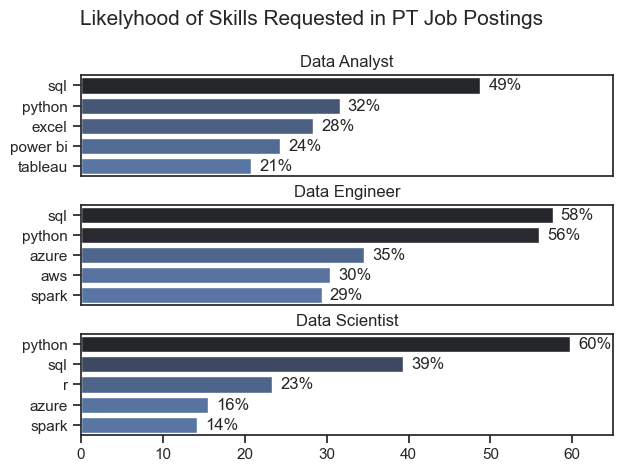
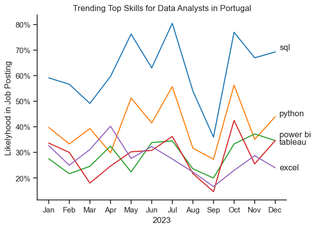
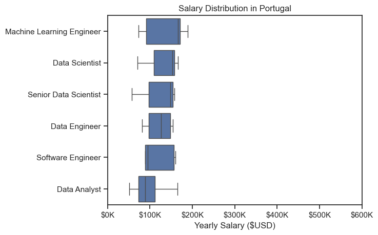
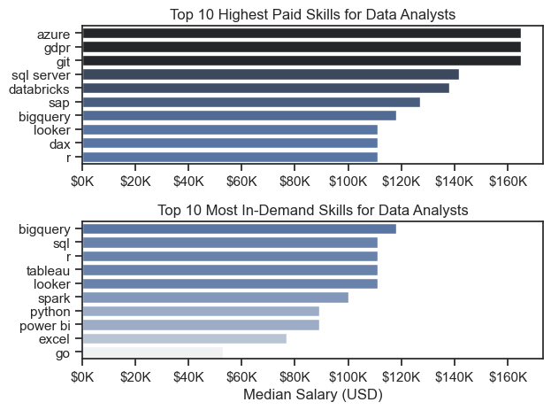
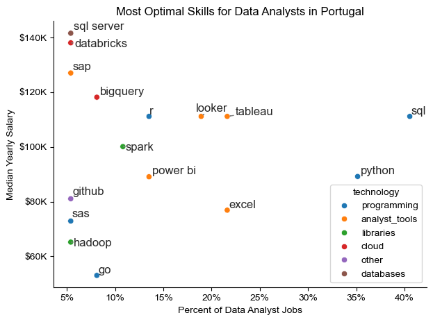

# Overview
Welcome to my analysis of the data job market, focusing on data analyst roles in my home country of Portugal. This project was created out of a desire to navigate and understand the job market more efficiently. It delves into the top-paying and in-demand skills to help find optimal job opportunities for data analysts.

The data was sourced from Luke Barousse's Python Course which provides a foundation for my analysis, containing detailed information on job titles, salaries, locations and essential skills. Through a series of Python scripts, I explore key questions such as the most demanded skills, salary ttrends, and the intersection of demand and salary in data analytics.

# The Questions
Below are the questions I want to answer in my project:
    1. What are the skills most most in demand for the top 3 most popular data roles?
    2. How are  in-demand skills trending for data analysts?
    3. How well do jobs and skills pay for data analysts?
    4. What are the optimal skills for data analysts to learn? (high demand and high paying)

# Tools Used
For my deep dive into the data analyst job market, I harnessed the power of several key tools:
    
- Python: The backbone of my analysis, allowing me to analyse the data and find critical insights. I also used the following Python libraries:
  - Pandas: This was used to analyse the data.
  - MatPlotLib: To visualise the data.
  - Seaborn: Used to create more advanced visuals.
- Jupyter Notebooks: The tool I used to run my Python scripts which let me easily include my notes and analysis.
- Visual Studio Code: My go-to for executing my Python scripts.
- Git and GitHub: Essential for version control and sharing my Python code and analysis, ensuring collaboration.


# The Analysis

## 1. What are the most demanded skills for the top 3 most popular data roles?

To find the most demanded skills for the top 3 most popular data roles, I filtered out those positions by which ones were the most popular, and got the top 5 skills for these top 3 roles. This query highlights the most popular job titles and their top skills, showing which skills I should pay attention to depending on the role I'm targeting.

View my notebook with detailed steps here: [2_Skill_Demand.ipynb](3_Project/2_Skill_Demand.ipynb)

### Visualise Data

```python
fig, ax = plt.subplots(len(job_titles), 1)

sns.set_theme(style='ticks')

for i, job_title in enumerate (job_titles):
    df_plot = df_skills_perc[df_skills_perc['job_title_short'] == job_title].head(5)
    sns.barplot(data=df_plot, x='skill_perc', y='job_skills', ax=ax[i], hue='skill_count', palette='dark:b_r')
    ax[i].set_title(job_title)
    ax[i].set_ylabel('')
    ax[i].set_xlabel('')
    ax[i].legend().set_visible(False)
    ax[i].set_xlim(0, 65)

    for n, v in enumerate(df_plot['skill_perc']):
        ax[i].text(v + 1, n, f'{v:.0f}%', va='center')

    if i != len(job_titles) - 1:
        ax[i].set_xticks([])

fig.suptitle('Likelyhood of Skills Requested in PT Job Postings', fontsize=15)
fig.tight_layout(h_pad=0.5) #fix the overlap
plt.show()
```

### Results



### Insights

- Python is a versatile skill, highly demanded across all three roles, but most prominently for Data Scientists (60%).
- SQL is the most requested skill for Data Analysts and Data Engineers, with it in about half of the job postings for both roles. For Data Scientists, Python is the most sought-after skill, appearing in 60% of job postings.
- Data Engineers and Data Scientists require more specialised technical skills (AWS, Azure, Spark) compared to Data Analysts who are expected to be proficient in more general data management and analysis tools (Excel, Power B.I., Tableau)

## 2. How are in-demand skills trending for Data Analysts?

### Visualise Data

```python

df_plot = df_DA_PT_percent.iloc[:, :5]

sns.lineplot(data=df_plot, dashes=False, palette='tab10')
sns.set_theme(style='ticks')
sns.despine()

plt.title('Trending Top Skills for Data Analysts in Portugal')
plt.ylabel('Likelyhood in Job Posting')
plt.xlabel('2023')
plt.legend().remove()

from matplotlib.ticker import PercentFormatter
ax = plt.gca()
ax.yaxis.set_major_formatter(PercentFormatter(decimals=0))


offsets = [0.8, 0.4, 1.5, -1.5, -0.8]  # Adjust manually as needed

for i in range(5):
    plt.text(11.2, df_plot.iloc[-1, i] + offsets[i], df_plot.columns[i])

plt.show()

```

### Results


*Bar graph visualising the trending top skills for data analysts in Portugal in 2023*

### Insights:
- SQL remains the most consistently demanded skill throughout the year, showing a gradual increase in demand.
- Excel experienced a decrease in demand starting in April and started to get back to normal demand after September.
- Power B.I. and Tableau are in equal demanded, both surpassing excel at the end of the year.
- Python demand varied a lot following the same trend as SQL but ends the year with an overall increase as did SQL.

## 3. How well do jobs and skills pay for Data Analysts?

### Salary Analysis for Data Nerds

#### Visualise Data

```python
sns.boxplot(data=df_PT_top6, x='salary_year_avg', y='job_title_short', order=job_order)
sns.set_theme(style='ticks')

plt.title('Salary Distribution in Portugal')
plt.xlabel('Yearly Salary ($USD)')
plt.ylabel('')
plt.xlim(0, 600000)
ticks_x = plt.FuncFormatter(lambda y, pos:f'${int(y/1000)}K')
ax = plt.gca().xaxis.set_major_formatter(ticks_x)
plt.show()
```

### Results


*Box plot visualising the salary distributions for the top 6 data job titles*

### Insights

- Machine Learning Engineers have the highest salaries overall, with a wider upper range than all other roles. This reflects the high demand and low supply of professionals who can build, deploy, and maintain machine learning systems in production environments. Their specialized skill set, including software engineering and ML optimization, justifies top-tier compensation.

- Data Scientists and Senior Data Scientists have similar median salaries, though Senior roles have a wider spread, suggesting more variation at higher experience levels. While both roles involve data modeling and analysis, “Senior” titles encompass a broader range of responsibilities and experience levels. The wider spread indicates that some senior roles are significantly better compensated, especially in leadership or niche domains.

- Data Engineers and Software Engineers show similar distributions, but Software Engineers may have a slightly higher upper range. Both roles require strong programming and systems knowledge, but software engineers often work on broader or more revenue-critical product teams, which can push salaries slightly higher—especially in product-driven companies.

- Data Analysts have the lowest salaries, with a visibly lower median and broader distribution on the lower end. Data analyst roles are typically considered entry-level or early-career, with lower technical barriers (e.g., fewer deployment or engineering responsibilities). The broad lower-end range may also reflect junior hires or roles at smaller local firms.

### Visualise Data

```python
fig, ax = plt.subplots(2, 1)

sns.set_theme(style='ticks')

sns.barplot(data=df_DA_top_pay, x='median', y=df_DA_top_pay.index, ax=ax[0], hue='median', palette='dark:b_r')
ax[0].legend().remove()
ax[0].set_title('Top 10 Highest Paid Skills for Data Analysts')
ax[0].set_ylabel('')
ax[0].set_xlabel('')
ax[0].xaxis.set_major_formatter(plt.FuncFormatter(lambda x, _: f'${int(x/1000)}K'))

sns.barplot(data=df_DA_skills, x='median', y=df_DA_skills.index, ax=ax[1], hue='median', palette='light:b')
ax[1].legend().remove()
ax[1].set_title('Top 10 Most In-Demand Skills for Data Analysts')
ax[1].set_ylabel('')
ax[1].set_xlabel('Median Salary (USD)')
ax[1].set_xlim(ax[0].get_xlim())
ax[1].xaxis.set_major_formatter(plt.FuncFormatter(lambda x, _: f'${int(x/1000)}K'))

fig.tight_layout()
plt.show()
```

### Results

*Two separate bar graphs visualising the highest paid skills for Data Analysts in Portugal*

### Insights

#### Highest Paying Skills
- Azure, GDPR, and Git are the top 3 highest-paying skills for data analysts. These are less common among analysts and signal cross-functional expertise:

    - Azure: Cloud data infrastructure skills are in high demand for scalable analytics.

    - GDPR: Legal/data governance knowledge is rare but essential in regulated industries.

    - Git: Version control indicates software-savvy analysts who can collaborate with engineers.

- SQL Server and Databricks also rank highly, reflecting backend and big data integration skills. These tools require comfort with complex data warehousing or distributed systems, setting these analysts apart.

- SAP, BigQuery, Looker, and DAX indicate platform specialization in enterprise analytics environments. Companies using these tools (especially SAP and Looker) are often larger and pay more for experts who can navigate their complex ecosystems.

- R ranks at the bottom of the top 10 for salary, despite its technical depth. R is widely used in academia and less common in production data pipelines, possibly lowering its market value in the corporate sector.

#### Demand
- BigQuery, SQL, and R top the demand list, suggesting a strong market need for foundational data querying and statistical analysis. These are core skills for almost all analyst roles; BigQuery stands out due to increased cloud adoption (especially Google Cloud).

- Tableau and Looker show strong demand, reflecting the emphasis on data visualization and business intelligence (BI). These tools are user-friendly and widely adopted in data-driven organizations for dashboarding and reporting.

- Spark and Python appear in the middle of the pack for demand. These are more technical tools associated with large datasets and automation, and while not always required for analysts, they’re highly valued when present.

- Power BI and Excel remain strong staples, especially in traditional or MS-heavy environments. Power BI is deeply integrated with Microsoft ecosystems, and Excel is still universally used—especially in financial/operations contexts.

- Go (Golang) is the least in-demand, possibly an outlier. Go is a systems/backend programming language, rarely used by data analysts. Its inclusion likely reflects niche roles or data engineers mislabeled as analysts.

## 4. What is the most optimal skill to learn for Data Analysts?

```python
sns.scatterplot(
    data=df_plot,
    x='skill_percent',
    y='median_salary',
    hue='technology'
)

sns.despine()
sns.set_theme(style='ticks')

texts = []

for i, txt in enumerate(df_DA_skills_high_demand.index):
    texts.append(plt.text(df_DA_skills_high_demand['skill_percent'].iloc[i], df_DA_skills_high_demand['median_salary'].iloc[i], txt))

adjust_text(texts, arrowprops=dict(arrowstyle="->", color='gray', lw=1))
ax= plt.gca()
ax.yaxis.set_major_formatter(plt.FuncFormatter(lambda y, pos: f'${int(y/1000)}K'))
ax.xaxis.set_major_formatter(PercentFormatter(decimals=0))

plt.xlabel('Percent of Data Analyst Jobs')
plt.ylabel('Median Yearly Salary')
plt.title('Most Optimal Skills for Data Analysts in Portugal')
plt.tight_layout()

plt.show()
```

### Results


*A scatter plot visaulising the most optimal skills (high paying & high demand) for data analysts in Portugal*

### Insights

#### Top Optimal Skills (High Salary + High Demand)
- SQL: Appears in ~40% of job postings and offers a solid six-figure median salary. It's the single most widely required skill and still pays well, making it an essential and optimal core skill.

- Python: High in both demand (~35%) and salary (~$105K). Combines flexibility in data manipulation, automation, and light ML — an excellent upskilling target.

- Tableau & Looker: Moderate to high demand (20–25%) and strong median salary ($105K+). These are optimal for analysts working in BI-heavy roles or organizations focused on visual insights.

#### Underrated but Lucrative (High Salary, Low Demand)
- SQL Server, Databricks, SAP: All offer very high median salaries ($125K–$145K) but appear in <10% of jobs. These are niche/high-leverage tools, often used in enterprise environments. Learning them could boost pay significantly, especially for senior roles.

- BigQuery: Solid midpoint with high pay (~$120K) and modest demand (~12%). As cloud adoption grows, this may become more widely requested — good to learn early.

#### Good Balance Skills (Average Demand + Good Pay)
R & Spark: Moderate salary ($100K–$110K) and demand (~10–15%). Good choices for analysts wanting to move into statistics-heavy or big data roles.

- Power BI: Slightly lower salary (~$95K) but widely used in Microsoft-centric ecosystems. Still a solid ROI skill if you're in Portugal’s enterprise-heavy job market.

#### Low-Value Skills (Low Demand + Lower Salary)
- Excel: Common (20%) but offers lower salary ($85K). It’s still required but doesn’t add much salary leverage alone — best paired with higher-value skills.

- Go, Hadoop, SAS: Low demand and sub-$80K salaries. These tools are either misaligned with analyst roles (e.g., Go, Hadoop) or being phased out (e.g., SAS in many sectors).

# What I Learned
Throughout this project, I deepened my understanding of the data analyst job market and enhanced my technical skills in Python, especially in data manipulation and visualisation. Here are a few specific things I learned:

- Advanced Python Usage: Utilising libraries such as Pandas for data manipulation, Seaborn and MatPlotLib for data visualisation, and other libraries helped me perform complex data analysis tasks more efficiently.
- Data Cleaning Importance: I learned that throrough data cleaning and preparation are crucial before any analysis can be conducted, ensuring the accuracy of insights derived from the data.
- Strategic Skill Analysis: The project emphasized the importance of aligning one's skills with the market demand. Understanding the relationship between skill demand, salary, and job availability allows for more strategic career planning in the tech industry.

# Insights
This project provided several general insights into the data job market for analysts:

- Skill Demand and Salary Correlation: There is a clear correlation between the deman for specific skills and the salaries these skills command. Advanced and specialised skills like Python and Oracle often lead to higher salaries.
- Market Trends: There are changing trends in skill demand, highlighting the dynamic nature of the data job market. Keeping up with these trends is essential for career growth in data analytics.
- Economic Value of Skills: Understanding which skills are both in-demand and well-compensated can guide data analysts in prioritizing learning to maximize their economic returns.

# Challenges I Faced
This project was not without its challenges, but it provided good learning opportunities:

- Data Inconsistencies: Handling missing or inconsistend data entries requires careful consideration and thorough use of the techniques to ensure the integrity of the analysis.
- Complex Data Visualisation: Designing effective visual representations of complex datasets was challenging as well as conveying insights clearly and compellingly.
- Balancing Breadth and Depth: Deciding how deeply to dive into each analysis while maintaining a broad overview of the landscape required constant balancing to ensure comprehensive coverage without getting lost in details.

# Conclusion
This exploration into the data analyst job market has been incredibly informative, highlighting the critical skills and trends that shape this evolving field. The insights I got enhanced my understanding and provide actionable guidance for anyone looking to advance their career in data analytics. As the market continues to change, ongoing analysis will be essential to stay ahead in data analytics. This project is a good foundation for future explorations and underscores the importance of continuous learning and adaptation in the data field.
